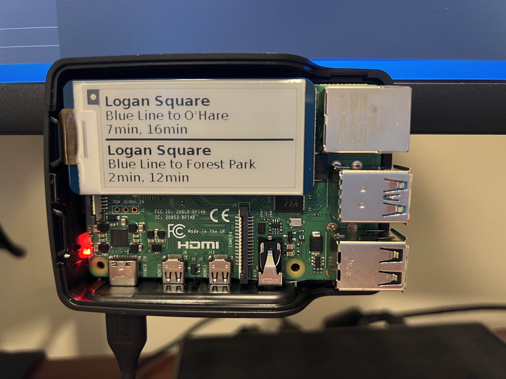
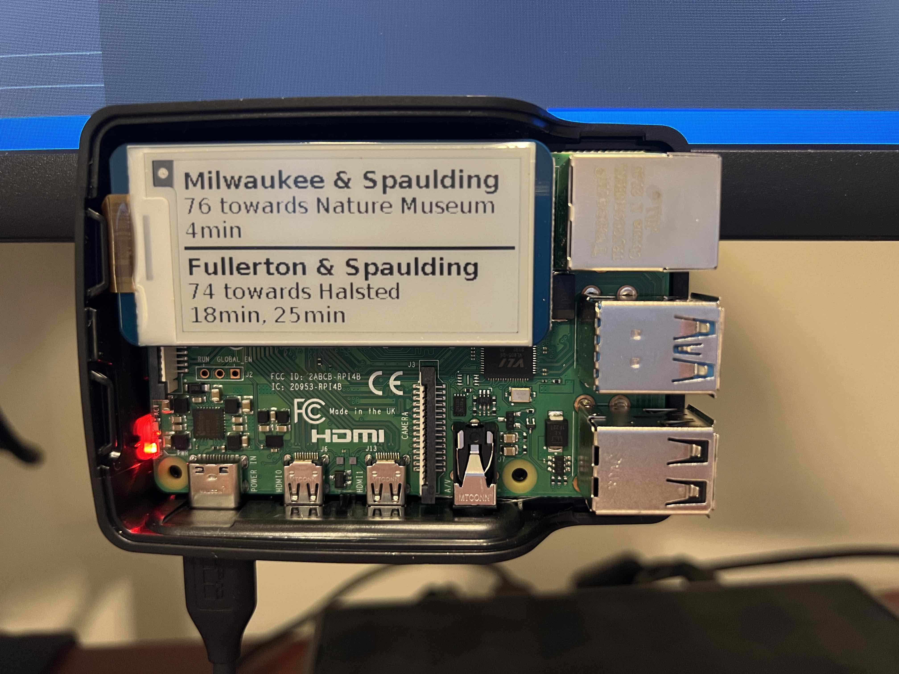

# ctapi (under development)

## Overview
This project is used to display the nearest train at a specific L stop in Chicao, IL. The project runs on a Raspberry Pi and the display used is the [Adafruit MagTag - 2.9" Grayscale E-Ink WiFi Display](https://www.adafruit.com/product/4800).

The display shows the following information (image coming soon):
* Station or Stop Name - example(s) being "Logan Square"
* Line & Destination of the train - example(s) being "Blue to O'Hare" & "Blue to Forrest Park"
* The current time - example being "HH:mm"
* The arrival time of the nearest trains or buses - example being "Due, 5min"

## Installation
* Create API access token on the [CTA Transit Tracker developer site](https://www.transitchicago.com/developers/traintracker/) and [CTA Bus developer site](https://www.transitchicago.com/developers/bustracker/) (optional)
* Clone the repository on your Raspberry Pi with the following `git clone https://github.com/brandonmcfadd/ctapi.git`
* Change into the working directory of the cloned repository `cd ctapi`
* Create a virtual environment to work in `python3 -m venv .`
* Activate the virtual environment `source bin/activate`
* Install the required dependencies `pip install -r requirements.txt`
* Create a file named `.env` in your directory with the following content
     `TRAIN_API_KEY = 'YOUR_TRANSIT_API_KEY'`
     `BUS_API_KEY = 'YOUR_TRANSIT_API_KEY'` (optional)
* Run the main program `python3 main.py`

## Configuration
* To change the station being displayed modify the Station/Stop Information in `main.py` with the station code(s) you want to use. `Line 43, 46 and 48`
* 'L' Station codes can be found on the following [site](https://data.cityofchicago.org/Transportation/CTA-System-Information-List-of-L-Stops/8pix-ypme) from the City of Chicago's Data Portal.
* Bus Stop Codes can be found using the [API](https://www.transitchicago.com/assets/1/6/cta_Bus_Tracker_API_Developer_Guide_and_Documentation_20160929.pdf) or via the Route Information Page on the Transit Chicago [site](https://www.transitchicago.com/schedules/)

## Example

